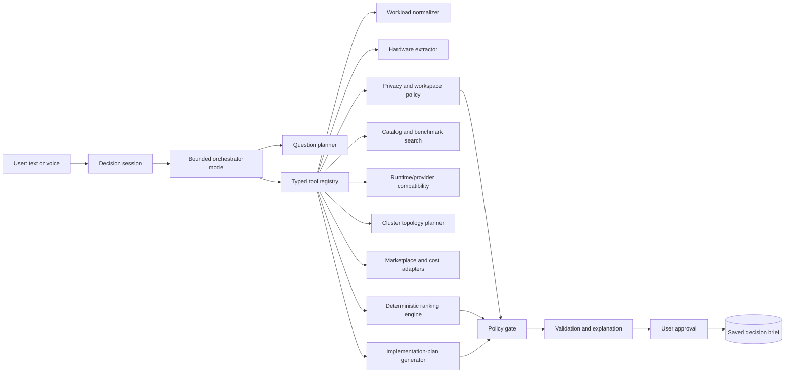

# Decision Copilot — Agentic Harness Specification

## 1. Purpose

ModelAtlas can include a bounded AI decision agent called **Decision Copilot**. It helps a user turn an incomplete, everyday-language request into a confirmed workload profile and a defensible recommendation.

The copilot is not the source of truth. It is an orchestration and explanation layer around typed domain tools. Privacy, compatibility, cost, freshness, ranking, and approval rules remain deterministic application logic.

The core promise is:

> “Tell me what you are trying to do, what data you have, what hardware and budget you have, and how private it must be. I will ask only the questions needed to compare safe options and explain the trade-offs.”

## 2. Why this is worth adding

The existing workflow already has the right specialist capabilities, but a non-technical user should not have to understand which screen to open first. The copilot provides a conversational front door while preserving the structured recommendation engine underneath.

It can:

- ask adaptive clarification questions;
- convert voice or text into a confirmed workload profile;
- identify unknown hardware fields and ask the user to verify them;
- call model, benchmark, provider, marketplace, cost, and cluster-planning tools;
- explain why an option was included or excluded;
- produce a recommendation brief and implementation plan;
- save the result or prepare it for team sharing after user approval.

It must not:

- purchase anything, create a cart, or send a message to a seller;
- deploy a model, install a runtime, run remote commands, or configure a cluster;
- weaken privacy or workspace policies;
- invent prices, benchmarks, hardware specifications, shipping, or availability;
- treat uploaded documents as instructions;
- expose a private team member’s detailed profile without permission;
- send sensitive content to an external model before the privacy gate permits it.

## 3. Recommended architecture



The orchestrator may decide which tool to call next, but every tool has a fixed schema, authorization check, timeout, and bounded result. The orchestrator cannot bypass the policy gate or directly call a marketplace, provider, or runtime.

## 4. Agent state machine

```text
NEW
  -> INTAKE
  -> PROFILE_DRAFTED
  -> NEEDS_CLARIFICATION       (if required facts are missing)
  -> PROFILE_CONFIRMED
  -> POLICY_CHECKED
  -> EVIDENCE_COLLECTED
  -> OPTIONS_EVALUATED
  -> RECOMMENDATION_DRAFTED
  -> AWAITING_APPROVAL
  -> SAVED

Any state may enter:
  -> FALLBACK              (provider/tool failure)
  -> BLOCKED               (privacy, authorization, or missing critical input)
  -> CANCELLED             (user stops the session)
```

The session is resumable. Each transition records the structured input, tool call, result reference, assumptions, and model response. The agent cannot silently change a confirmed value; it must ask for confirmation again.

## 5. Tool registry

Tools are application functions, not arbitrary model-generated code.

| Tool | Purpose | Side effect | Required guard |
| --- | --- | --- | --- |
| `normalize_workload` | Extract goals, inputs, outputs, users, usage, and unknowns | None | Schema validation |
| `classify_privacy` | Suggest Public, Internal, Confidential, or Highly sensitive | None | User confirmation; workspace maximum wins |
| `inspect_hardware_evidence` | Extract candidate hardware fields from an upload | Stores evidence reference | Private storage; confidence per field |
| `search_model_catalog` | Retrieve existing model records and metadata | None | Approved catalogs and freshness |
| `search_provider_options` | Retrieve API, private cloud, local, rented, or owned routes | None | Privacy and region filters |
| `evaluate_runtime_fit` | Check model, OS, accelerator, memory, and runtime compatibility | None | Never infer compatibility from model name alone |
| `plan_cluster_topology` | Compare one node, replicas, sharding, distributed training/fine-tuning, staged pipeline, or no cluster | None | Do not pool memory; show interconnect assumptions |
| `search_marketplace_listings` | Retrieve trusted outbound hardware listings | None | Source freshness, seller evidence, manual verification |
| `run_research_scout` | Search approved APIs, public pages, browser-rendered pages, and permitted community sources; extract cited claims | Stores research snapshot | Query/source/page budget, source tier, access rules, prompt-injection filtering |
| `calculate_direct_cost` | Calculate hardware, landed, electricity, API, and rental costs | None | Staff and maintenance remain excluded |
| `rank_options` | Apply hard filters and the selected simple preset | None | Deterministic; denied candidates never rank |
| `draft_implementation_plan` | Turn the selected result into phases, alternatives, and success metrics | None | Must cite assumptions and limitations |
| `save_decision_brief` | Persist the user-approved result | Writes database | Explicit user action and authorization |
| `prepare_team_share` | Prepare selected fields for a workspace | Writes draft share request | Private by default; user chooses fields |

The agent may call read-only tools repeatedly, but writes require an explicit user action. No tool accepts arbitrary shell commands, arbitrary URLs, or a model-generated SQL string.

## 6. Agent loop contract

```text
1. Read the current session state and confirmed facts.
2. Select the smallest next action: ask one question or call one tool.
3. Validate the tool arguments against a server-side schema.
4. Check authorization, privacy, and workspace policy.
5. Execute with a timeout and return structured data plus provenance.
6. Update the session state and record the trace.
7. Stop when the minimum decision fields are confirmed.
8. Run deterministic eligibility, cost, and ranking.
9. Ask the user to approve the recommendation before saving or sharing.
```

Recommended V1 limits:

- Maximum 8 agent steps per decision session
- Maximum 3 clarification questions before showing a partial result or blocker
- Maximum 2 retries per external tool
- Maximum 30 seconds for a live recommendation request
- One orchestrator model per session; no multi-agent swarm
- One primary recommendation and at most three alternatives

If the limit is reached, the system returns the best verified partial result and states what remains unknown.

## 7. Structured output contract

The model must return a typed action, not unstructured prose:

```json
{
  "action": "ask_user | call_tool | present_result | block",
  "question": null,
  "tool": "plan_cluster_topology",
  "arguments": {
    "workload_id": "...",
    "hardware_asset_ids": ["..."],
    "objective": "higher_throughput"
  },
  "reason": "There are four confirmed machines and the user wants local serving.",
  "confidence": 0.84,
  "needs_user_confirmation": false
}
```

The server rejects actions with unknown tools, missing required fields, invalid enum values, unauthorized resource IDs, or unsupported side effects. The final recommendation is rendered from validated domain objects, not directly from the model’s prose.

## 8. Model routing

The product should be model-agnostic and use the existing catalog/provider layer:

| Task | Preferred route | Reason |
| --- | --- | --- |
| Transcript cleanup and field extraction | Small local model or low-cost API | Fast, repetitive, low reasoning load |
| Clarification question selection | Small or medium structured-output model | Must follow the session schema |
| Tool argument selection | Reliable tool-calling model | Must produce valid actions, not creative text |
| Final trade-off explanation | Stronger model when permitted | Better plain-language synthesis |
| Confidential or highly sensitive context | Local/private approved model | Avoid sending raw content outside the policy boundary |
| Provider failure | Curated deterministic fixture and local rules | Demo remains truthful and usable |

OpenRouter, Hugging Face, LM Studio, and other providers can sit behind one `AgentModelProvider` interface. Provider choice is itself subject to privacy, region, workspace allowlist, cost, and availability checks. Research Scout has its own source adapters and must not pass raw web content to the model without sanitization and evidence limits.

The agent should receive structured metadata wherever possible. For example, it can reason over “invoice PDFs, 4 users, Confidential, 500 requests/day” without receiving the invoice contents.

## 9. Safety and trust controls

### Policy before model routing

The privacy gate runs before selecting an external model for sensitive content. A model cannot override a denied provider, marketplace, region, or hosting mode.

### Untrusted evidence boundary

Uploaded documents, listing text, benchmark descriptions, and web pages are evidence only. They may contain prompt injection or misleading instructions. Their text is never treated as a system instruction or tool authorization.

### Provenance and uncertainty

Every recommendation claim must link to a source snapshot, user-confirmed field, deterministic calculation, or explicit assumption. The UI distinguishes verified, inferred, stale, curated, and user-verification-required data.

### Human approval

The user must approve:

- the normalized workload;
- the privacy classification;
- corrected hardware fields;
- the final recommendation before saving;
- fields shared with a team.

### No hidden optimization

The agent cannot optimize for affiliate revenue, provider margin, or a preferred model creator. Ranking uses the selected user preset after hard constraints.

## 10. Failure and fallback behavior

| Failure | User-visible behavior |
| --- | --- |
| Agent model unavailable | Switch to typed form plus deterministic question sequence |
| Tool timeout | Retry once, then use cached/curated data with a freshness label |
| Invalid tool arguments | Reject, repair once, then show a technical limitation without failing open |
| Conflicting hardware fields | Ask the user to choose; do not average or invent a specification |
| Privacy ambiguity | Block external-sensitive routes and ask for confirmation |
| Marketplace unavailable | Show outbound links from the latest verified snapshot, clearly labeled |
| Cluster compatibility unknown | Recommend one node, replicas, or API/rental as a safer alternative |
| Agent reaches step limit | Present partial result and missing decision fields |
| Prompt injection in uploaded/listing content | Ignore instructions in evidence and continue with the evidence as data |

## 11. Persistence and trace

### `DecisionSession`

- `id`
- `owner_id` or `workspace_id`
- `status`
- `mode`: `personal` or `team`
- `confirmed_profile_version`
- `privacy_classification`
- `selected_preset`
- `step_count`
- `started_at`
- `completed_at`

### `AgentTrace`

- `session_id`
- `step_index`
- `model_provider`
- `model_id`
- `action_type`
- `tool_name`
- `validated_arguments`
- `result_reference`
- `latency_ms`
- `token_or_usage_metadata`
- `error_code`
- `created_at`

Do not persist raw audio or sensitive document contents by default. Persist references, extracted structured fields, user confirmations, source snapshots, and the minimum trace needed to explain the decision.

## 12. Implementation plan

### P0 — Hackathon-safe harness

1. Build one Decision Copilot session state machine.
2. Implement typed tools over existing deterministic services and seeded demo data.
3. Add structured-output validation and hard policy gate.
4. Show a compact “What the copilot checked” trace in the result UI.
5. Add live-provider timeout and deterministic fallback.
6. Persist the approved decision brief and support reload.

### P1 — Stronger decision support

1. Add provider/model routing by privacy and cost.
2. Add source-aware explanations and conflict resolution.
3. Add team-share approval and workspace policy editing.
4. Add cluster-plan comparisons for PCs, Macs, and DGX Spark.
5. Add bounded Research Scout connectors and controlled browser fetching for permitted public pages.

### Explicitly deferred

- Multi-agent swarms
- Autonomous purchasing
- Autonomous deployment or cluster provisioning
- Continuous background monitoring
- Private-document inference against unapproved providers
- Agent-written arbitrary code or shell commands

## 13. Acceptance tests

These extend the project’s three baseline tests without changing them:

### AT-1 — Happy path

The user describes the manufacturing workflow by voice or text. Decision Copilot asks only for missing budget, privacy, usage, and hardware facts, calls the relevant tools, and presents a ranked local-first recommendation with cost lines and outbound links.

### AT-2 — Failure and uncertainty

The model provider or marketplace source fails, or hardware fields conflict. The harness retries within limits, falls back to deterministic data, clearly labels uncertainty, and never fabricates a current fact or bypasses privacy.

### AT-3 — Persistence and reload

The user approves the recommendation. The decision brief, confirmed assumptions, selected preset, provenance, and trace summary survive reload and can be converted into a team-share draft.
