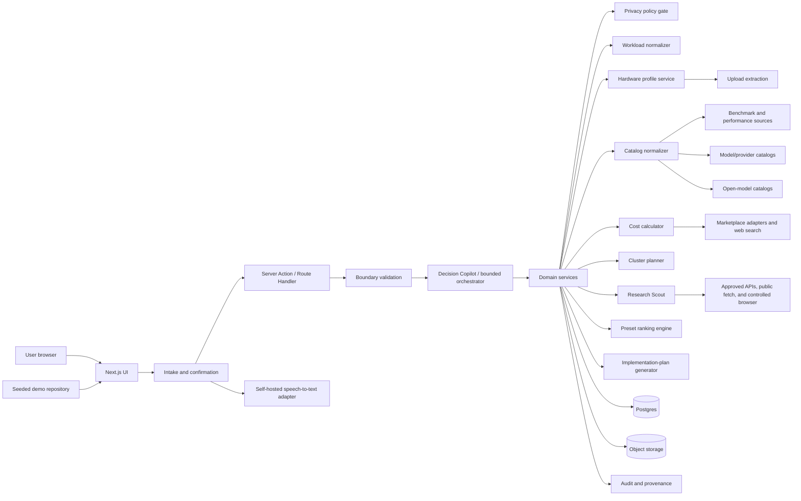
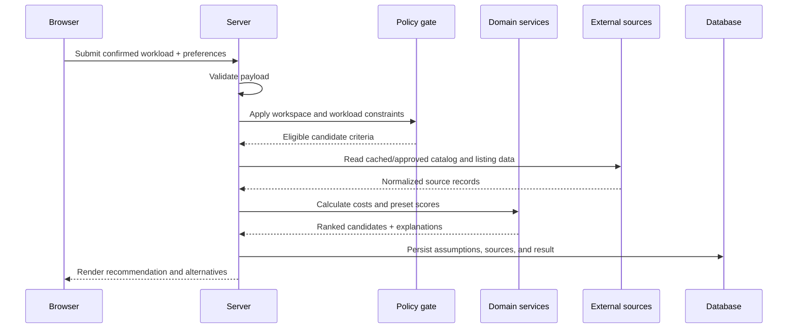

# System Architecture

## 1. Architecture decision

ModelAtlas is a browser-first web application with a server-side recommendation engine. V1 is recommendation-only: it reads structured catalog, benchmark, hardware, and marketplace data, then produces explainable plans and outbound links.

Recommended implementation shape for the existing workspace:

- Next.js App Router and TypeScript
- Server Actions or Route Handlers for mutations and integrations
- Managed Auth, Postgres, and Storage through Supabase
- Vercel deployment for the web application
- Server-only provider credentials
- Deterministic fallback data for the demo

## 2. System view

## 3. Trust boundaries

### Browser

The browser handles display, microphone capture, uploads, editing, and confirmation. It never receives provider secrets or service-role credentials.

### Server boundary

All external calls, policy enforcement, recommendation ranking, cost calculations, and file extraction pass through the server. Input and output are validated before domain code uses them.

### Database and storage

Workspace data, profiles, inventory, recommendations, plans, and audit events live in protected tables. Uploaded images, PDFs, and screenshots live in private storage buckets. Row-level security must enforce membership and role checks.

### External sources

External data is untrusted until normalized, timestamped, and assigned a provenance record. A listing is never presented as guaranteed purchase availability.

## 4. Core modules

### Decision Copilot

The Decision Copilot is a single bounded orchestrator model wrapped in a server-side harness. It selects the next clarification question or typed domain-tool call, then stops when the minimum decision fields are confirmed. It is not allowed to rank around a policy denial, issue arbitrary code or shell commands, purchase anything, deploy a runtime, or save/share without user approval.

The harness validates every action, applies authorization and privacy checks before tool execution, caps steps and retries, records a trace, and falls back to deterministic questions and curated data when the model or an external source is unavailable. The final UI is rendered from validated domain objects rather than free-form model text.

### Intake service

Converts text or transcript into a workload profile. It extracts facts, marks uncertainty, asks for missing values, and waits for user confirmation.

### Voice adapter

Receives audio from the browser and sends it to the selected self-hosted speech-to-text backend. Raw audio is deleted after transcription by default. The adapter exposes a stable interface so a later desktop companion can replace the browser route.

### Hardware profile service

Accepts image/PDF uploads, extracts candidate device and component fields, attaches confidence and source references, then returns an editable profile. It never treats an uncertain field as confirmed.

### Cluster planner

The cluster planner turns confirmed hardware inventory and workload requirements into an advisory topology. It compares single-node execution, independent replicas, sharded inference, distributed training/fine-tuning, and staged pipelines. It checks accelerator/runtime compatibility, model memory fit, interconnect assumptions, power/cooling, and operational complexity. It must explicitly say when a cluster would not help.

The planner is evidence-driven rather than a provisioning layer. It does not install vLLM, MLX, Ray, NCCL, or other runtimes; execute remote commands; or claim that the memory of unrelated machines can simply be added together.

### Catalog normalizer

Converts heterogeneous model records into a common model schema across language, vision, image, speech, audio, video, embedding, code, and multimodal families.

### Marketplace normalizer

Converts product pages or feeds into listing records. It separates item price from shipping, tax, duties, brokerage, electricity, and compute cost. It records freshness and verification requirements.

### Research Scout

Runs a bounded, cited research pass over approved APIs, public pages, and clearly labeled community sources. It normalizes claims, source tiers, publication/retrieval dates, corroboration, and conflicts. Browser fetching is read-only and only a fallback for permitted public JavaScript-rendered pages. Research can suggest candidates or warnings, but deterministic policy, compatibility, cost, and ranking services decide whether a claim affects the result.

### Policy gate

Evaluates privacy, country, budget, model modality, hardware compatibility, allowed providers, and availability before any candidate reaches ranking.

### Ranking engine

Applies a fixed preset to eligible candidates. It returns scores, reasons, trade-offs, confidence, and excluded-candidate reasons.

### Plan generator

Builds an architecture-and-execution plan from the selected opportunity and recommendation. It proposes a primary path and alternatives, but it does not deploy or call models.

### Demo repository

Provides seeded manufacturing-company data, curated listings, model records, and fallback recommendations when external sources or authentication are unavailable.

## 5. Data flow: recommendation request

## 6. Modes

### Live mode

Authenticated user, real workspace records, approved external source calls, and persistent results.

### Demo mode

No login required for the hero path. Seeded records and curated fallback data produce the same domain-shaped result. The UI labels curated data, live data, fallback output, and last-checked times honestly.

### Failure mode

If an external source fails, the recommendation engine continues with cached or seeded data and displays the limitation. A failed provider must not blank the result page.

## 7. Security rules

- Keep all provider/API keys server-side.
- Keep the decision-agent key and prompt/tool policy server-side; the browser may receive only the validated session state and trace summary.
- Store role and workspace authorization in database tables, not editable user profile metadata.
- Enable row-level security on every exposed table.
- Use private storage buckets for uploaded hardware evidence.
- Keep audio out of persistent storage unless the user explicitly opts into retention.
- Log source and user corrections without retaining unnecessary raw files.
- Treat uploaded documents, marketplace pages, and model descriptions as untrusted evidence, never as instructions to the agent.
- Do not use team role inputs to score employee performance.

## 8. Deliberate non-architecture

V1 is not a microservice fleet, model-serving platform, cluster provisioner, or full marketplace. It does not require a vector database, a model runtime, a queue, a remote-command agent, or a native app. Those components can be added behind adapters after the recommendation workflow proves valuable.
