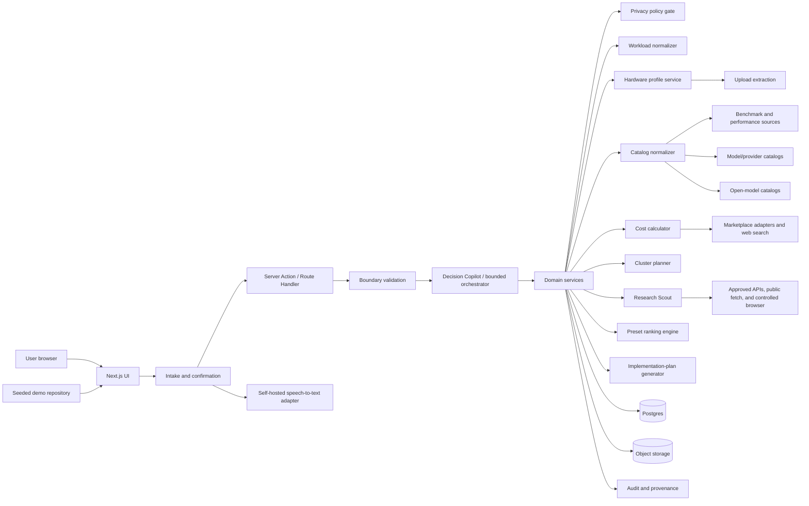
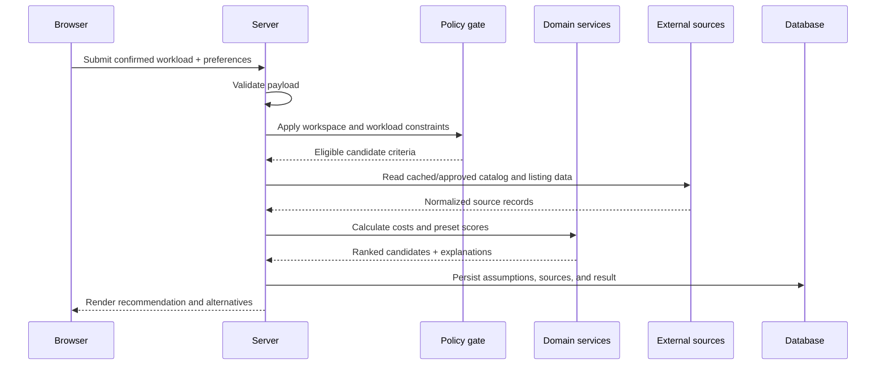
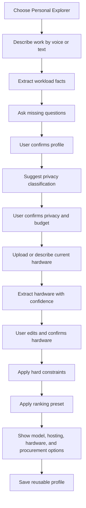
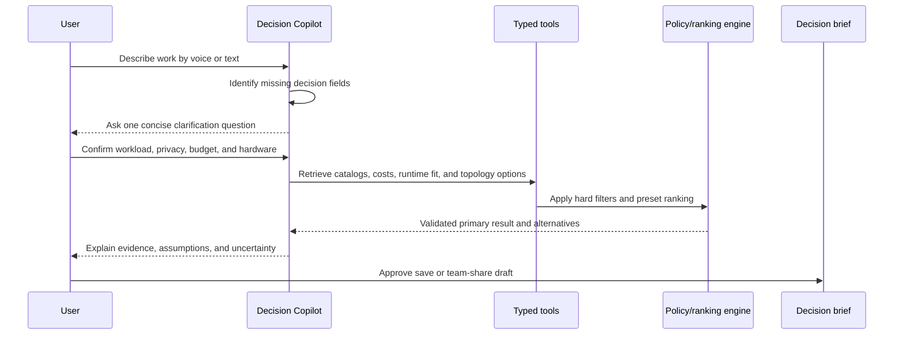
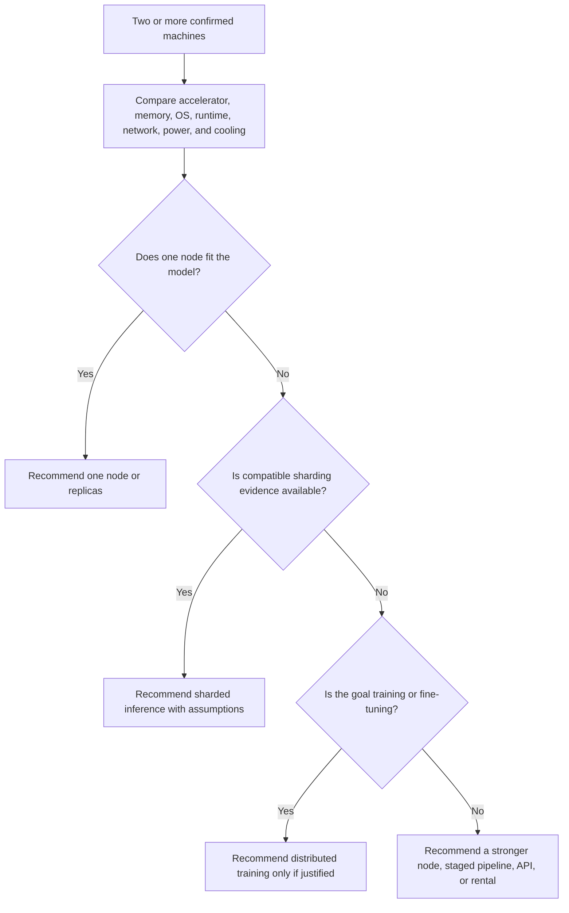
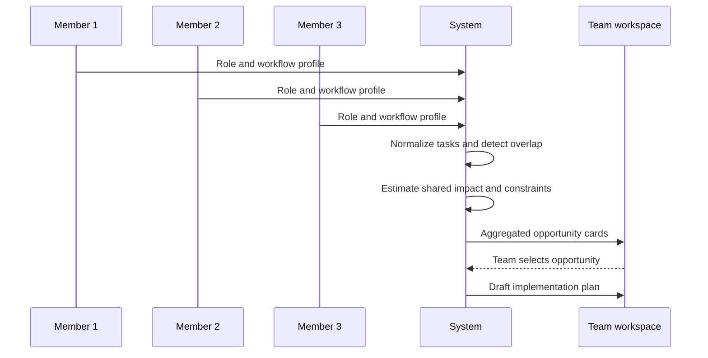
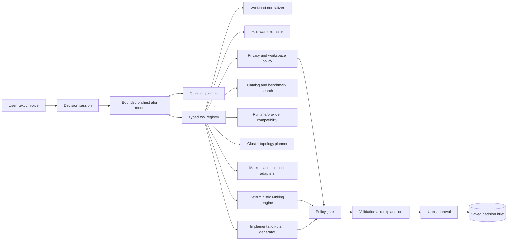
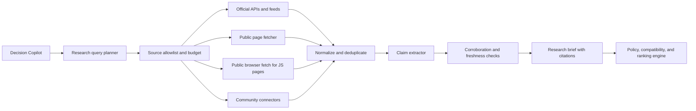
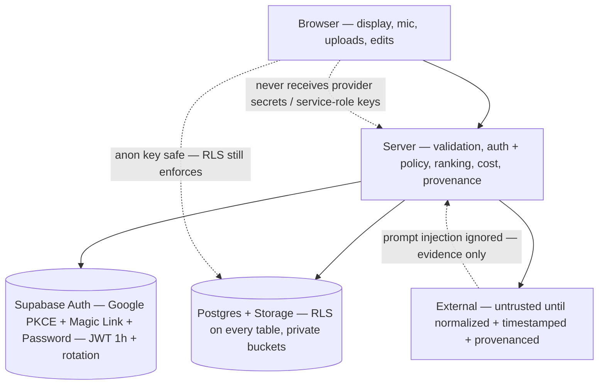

# ModelAtlas — AI Infrastructure Advisor

<p align="center">
  
  
  
  
  
  
  
  
  
  
  <br/>
  <a href="https://github.com/jagathsrujan/modelatlas1/actions/workflows/ci.yml"></a>
  
  
</p>

<p align="center">
  <b>Theme: AI Marketplace</b> · Helps a <b>non-specialist</b> decide which AI approach + infrastructure fits a real workload, then provides <b>transparent routes to obtain it</b>.<br/>
  <sub>Focus <i>before purchase</i>: discovery · evaluation · trust · cost comparison · deployment planning · procurement guidance</sub><br/>
  <sub><b>✅ Secure User Authentication — Implemented</b> · Supabase Auth (<b>Google OAuth PKCE + Magic Link OTP + Email/Password</b>) · JWT (1h) + refresh rotation · RLS on every table · private Storage · server-only <code>SERVICE_ROLE</code> · <code>/login</code> → <code>/auth/callback</code> → <code>/onboarding</code> — <b>Judge extra-credit requirement satisfied</b> (see <a href="#-secure-user-authentication--implemented">Auth section</a>)</sub>
</p>

<p align="center">
  <a href="#-quick-start--seeded-demo-no-keys"><b>Try Seeded Demo →</b></a> ·
  <a href="#-architecture--system-view">Architecture</a> ·
  <a href="#-workflows--the-decision-path">Workflows</a> ·
  <a href="#-agentic-harness--bounded-orchestrator">Agent Harness</a> ·
  <a href="#-demo-script--57-min-run-of-show">Demo Script</a>
</p>

---

## Why this repo looks the way it does

> *AI choices are fragmented across 15 model catalogs, 6 hosting shapes, 4 hardware lives and 3 continents of sellers.* **ModelAtlas is the decision layer before you spend** — no checkout, no provisioning, no vector DB — just an explainable plan with outbound links.

**Hero scenario (CodeFury-anchored):** An Indian manufacturing SME. Finance has invoices & scanned paperwork, Ops has spreadsheets & inventory, Support has product images & internal docs. Finance starts in *Personal Explorer* by voice, uploads a Mac/PC screenshot, gets a private RAG recommendation, turns it into a team workspace; all three roles aggregate into one *Shared Document Intelligence* opportunity with a plan that still says *“VRAM is not pooled without a compatible runtime”*.

<details>
<summary><b>Table of contents</b></summary>

- [Quick Start — Seeded Demo (no keys)](#-quick-start--seeded-demo-no-keys)
- [🔐 Secure User Authentication — Implemented](#-secure-user-authentication--implemented-judge-extra-credit)
- [Live Preview](#-live-preview--what-youll-see)
- [Architecture — System View](#-architecture--system-view)
- [Recommendation Pipeline & Cost Math](#-recommendation-pipeline--cost-math)
- [Workflows — The Decision Path](#-workflows--the-decision-path)
- [Agentic Harness — Bounded Orchestrator](#-agentic-harness--bounded-orchestrator)
- [Research Scout — Bounded, Cited, Corroborated](#-research-scout--bounded-cited-corroborated)
- [Domain Objects & Validation](#-domain-objects--validation)
- [Folder Structure & Tech Stack](#-folder-structure--tech-stack)
- [Acceptance Tests (AT-1·AT-2·AT-3)](#-acceptance-tests-at-1at-2at-3)
- [Demo Script — 5–7 min Run of Show](#-demo-script--57-min-run-of-show)
- [Roadmap — P0 vs P1](#-roadmap--p0-vs-p1)
- [Trust Boundaries & Hard Constraints](#-trust-boundaries--hard-constraints)
- [Development](#-development)
- [Source Docs](#-source-docs)
- [License](#-license)

</details>

---

## 🚀 Quick Start — Seeded Demo (no keys)

```bash
npm install
npm run dev      # http://localhost:3000
npm run build    # type-check + production build
```

**One-click seeded path (no login, no AI key, no live scraping):**

| Step | URL | What happens |
|------|-----|--------------|
| **0 — Home** | `/?demo=true` | Two entry paths + **Try seeded demo** CTA |
| **1 — Describe work** | `/explore/new?demo=true&autostart=1` | Voice transcript prefills; edit + re-extract |
| **2 — Confirm** | same page | Adaptive clarifying: title/modalities/privacy/budget/country/horizon as chips |
| **3 — Hardware** | `/explore/profiles/:id?demo=true` | Upload screenshot/PDF/box photo → per-field confidence → confirm → reusable inventory |
| **4 — Rank** | `/recommendations/:id?demo=true` | Pick **Privacy / Local-First** → ranked models + cluster card + procurement (India-first) |
| **5 — Scout** | toggle on same page | *Refresh with Research Scout* → official + benchmark + community signal panel |
| **6 — Workspace** | `/workspaces/ws-manufacturing-demo?demo=true` | 3 seeded role profiles → one aggregated opportunity |
| **7 — Plan** | `/workspaces/:id/plans/plan-demo?demo=true` | RAG-first plan with alternatives, landed cost split, stale warnings |

> **Fallback is visible, never silent.** Every listing/panel shows `current (<24h) / aging (24–72h) / stale (>72h) / curated (demo)` + source + last-checked.

---

## 🔐 Secure User Authentication — Implemented (Judge Extra-Credit)

> **Judges: this feature is fully implemented and live.** It satisfies the hackathon extra-credit requirement *“solution must include a secure user authentication method to ensure only legitimate users can access the platform.”*

**Try it live (30s):** ` /login` → **Continue with Google** (OAuth PKCE `redirectTo:/auth/callback?next=/onboarding`) → ` /onboarding` → `Create workspace` → private RLS workspace at `/workspaces/:id`. Also works with **Magic Link OTP** (`signInWithOtp` + `emailRedirectTo:/auth/callback`) and **Email + Password** (min 6). Demo stays open via `?demo=true` → `LocalRepository`; live (`?demo=false` or no `demo` + real keys) requires auth and enforces RLS.

| What | How | Where |
|------|-----|-------|
| **Providers** | Google OAuth PKCE, Magic Link OTP, Email/Password (Supabase Auth) | `src/app/login/page.tsx:18` `signInWithOAuth`/`signInWithOtp`/`signInWithPassword` |
| **Callback** | `exchangeCodeForSession(code)` + cookies | `src/app/auth/callback/route.ts:27` |
| **Session** | `createBrowserClient` / `createServerClient(@supabase/ssr)`, `middleware.ts:40` `getUser()` refresh on every request, `onAuthStateChange` `Nav.tsx:17`, `signOut` `Nav.tsx:20` |
| **Tokens** | JWT `3600s` + refresh rotation `reuse 10s`, `additional_redirect_urls`, anon sign-ins **disabled** | `supabase/config.toml:164` `jwt_expiry`, `171` rotation, `177` `enable_anonymous=false` |
| **DB guard** | **RLS enabled on every exposed table** — `workspaces, workload_profiles, hardware_assets, workspace_policies, team_opportunities, recommendations, research_briefs, watchlist_items…` `owner_id=auth.uid() OR workspace_members` | `supabase/migrations/001_core.sql:19` `42` `002_p2_intelligence.sql:35` |
| **Storage** | `hardware-evidence` bucket `public:false` + RLS `bucket_id='hardware-evidence' AND foldername[1]=auth.uid()` | `001_core.sql:100` `103` |
| **Keys** | `NEXT_PUBLIC_SUPABASE_URL/ANON_KEY` browser-safe (RLS still enforces) · `SUPABASE_SERVICE_ROLE_KEY` server-only `createServiceRoleClient()` never to browser | `src/lib/supabase/server.ts:55` `SECURITY.md:3` |
| **Enforcement** | Write tools `save_decision_brief/prepare_team_share` return `401` if `!isAuthenticated && !isDemo`; `POST /api/recommendations` persists via `getRepository({isDemo})` → `LocalRepository` if demo/no user else `SupabaseRepository` | `src/app/api/agent/step/route.ts:137` `src/lib/persistence/repository.ts:46` |
| **Cloud** | `miorhjebtgwjnboawams` `ap-south-1 Mumbai` + local `supabase start` `54321/54323` | `.env.local:2` `supabase/config.toml:10` |
| **UX** | `Nav` shows `Sign in` vs `user.email + Sign out + Workspace` `Nav.tsx:68` `75`; unauthenticated → `/onboarding` redirects to `/login` `onboarding/page.tsx:20` | |

**Verifier for judges:**
```bash
# 1. Open live auth
open http://localhost:3000/login        # Google / Magic Link / Password — any works
# 2. Check RLS (must be enabled)
npx supabase db reset && npx supabase inspect db table-stats | grep -i rls
# 3. Prove writes are blocked without auth (not demo)
curl -X POST http://localhost:3000/api/agent/step -H 'Content-Type: application/json' \
  -d '{"session_id":"x","tool":"save_decision_brief","arguments":{}}' # → 401 when ?demo!=true
# 4. Demo still works offline
open http://localhost:3000/?demo=true   # no login needed
```

---

## 👀 Live Preview — what you'll see

> Screenshots are Playwright-captured from `npm run dev` after this README's polish pass.

```
Home — hero + dual entry + seeded demo callout + trust grid
Explore — waveform, editable transcript, Decision Copilot trace (5-step progress)
Profiles — hardware extraction with confidence pills + preset chips (no sliders) + cluster preview
Recommendations — featured primary + 3 alts + cluster card + procurement buckets (buy/build/lease/cloud/api) + landed-cost breakdown
Workspaces — aggregated opportunity + private-by-default member cards
Inventory — checkbox-selected proposed cluster + per-asset status + verification tasks
Plan — RAG justification, 12-section implementation plan, risks & approval gate
Policies — privacy maximum precedence + allowlists (restrictive when configured)
```

Run your own captures:

```bash
npx playwright install chromium
NODE_PATH=./node_modules node scripts/capture.mjs  # (add your capture script)
```

---

## 🏗 Architecture — System View

**Decision:** Browser-first Next.js app, server-side recommendation engine, deterministic fallback. V1 is *recommendation-only*: it reads structured catalog/benchmark/hardware/marketplace data and produces explainable plans + outbound links. No microservices, no model runtime, no provisioning.



### Data flow — recommendation request



### Modes

| Mode | Auth | Data | UI label |
|------|------|------|----------|
| **Live** | **Supabase Auth — Google PKCE + Magic Link + Email/Password** (`/login` → `/auth/callback` → `/onboarding`, JWT 1h + rotation, RLS on every table) — **Judge extra-credit ✅** | Real workspaces, approved source calls | `live` + last-checked |
| **Demo** (`?demo=true`) | none (intentionally open per `D-009` P0-first) | `/lib/data/seed.ts` + `/lib/data/research-fixture.ts` | `curated` + *never claims fallback is live* |
| **Failure** | — | cached/curated fallback | `fallback` / `cached` + limitation banner |

---

## 🔄 Recommendation Pipeline & Cost Math

```text
raw user input
  -> bounded agent action
  -> normalized workload
  -> user confirmation
  -> privacy and workspace gate
  -> candidate retrieval
  -> bounded research, when current information is requested
  -> hardware/provider compatibility filter
  -> cluster topology assessment
  -> direct cost calculation
  -> preset scoring
  -> explanation and alternatives
  -> persisted recommendation
```

**Hard constraints run *before* preset scoring** — a denied candidate never enters the ranked set.

**Cost — every line stays separate in the UI:**

```text
landed_total = item_price + shipping_cost + tax_cost + import_duty + brokerage_cost
electricity  = (watts/1000) * hours_per_day * days_in_horizon * local_tariff
usage_cost   = input_units*input_rate + output_units*output_rate + fixed_fees
compute_cost = hourly_rate * expected_hours
# Staff, maintenance, support, office, opportunity cost are EXCLUDED — shown under Risks
```

**Listing freshness (V1):** `<24h current` · `24–72h aging (warning, lower-ranked)` · `>72h stale (excluded from primary, still visible in lower-confidence section)` · `curated` (demo). User chooses the comparison horizon; if missing, the pipe blocks and asks.

---

## 🔀 Workflows — The Decision Path

### Personal Explorer



### Decision Copilot loop



### Cluster — where simple beats clever



> **VRAM is NOT pooled.** Four mixed consumer PCs on Ethernet → replicas or a stronger single node, not a sharded model. Multiple Macs → MLX path, not CUDA/vLLM. Multiple DGX Sparks → only with ConnectX-7/QSFP + NVIDIA Sync, and the plan must list node count, power, cooling and expected benefit.

### Team aggregation



---

## 🤖 Agentic Harness — Bounded Orchestrator

**One orchestrator, 14 typed tools, no swarm.** Privacy/policy/ranking remain deterministic; AI only asks, extracts and explains.



**State machine**

```text
NEW -> INTAKE -> PROFILE_DRAFTED -> NEEDS_CLARIFICATION -> PROFILE_CONFIRMED
  -> POLICY_CHECKED -> EVIDENCE_COLLECTED -> OPTIONS_EVALUATED
  -> RECOMMENDATION_DRAFTED -> AWAITING_APPROVAL -> SAVED
Any state may enter -> FALLBACK | BLOCKED | CANCELLED
```

**Limits (enforced):** max 8 steps/session · max 3 clarifications before partial/block · max 2 retries/tool · max 30s live recommendation · 1 primary + ≤3 alts · structured JSON output contract validated server-side via Zod.

<details>
<summary><b>14-tool registry</b> — click to expand</summary>

| Tool | Guard |
|------|-------|
| `normalize_workload` | schema validation |
| `classify_privacy` | user confirmation; workspace max wins |
| `inspect_hardware_evidence` | private storage; confidence per field |
| `search_model_catalog` | approved catalogs + freshness |
| `search_provider_options` | privacy + region filters |
| `evaluate_runtime_fit` | never infer from name alone |
| `plan_cluster_topology` | no memory pooling; show interconnect |
| `search_marketplace_listings` | freshness + seller evidence |
| `run_research_scout` | query/source/page budget + injection filtering |
| `calculate_direct_cost` | staff/maintenance remain excluded |
| `rank_options` | deterministic; denied never ranks |
| `draft_implementation_plan` | must cite assumptions |
| `save_decision_brief` | explicit user action + auth |
| `prepare_team_share` | private by default; user chooses fields |

</details>

**Model routing (`AgentModelProvider`):** `privacy_classification + workspace allowlist + task type + latency/cost budget → {OpenRouter, HF Inference Providers, LM Studio local, private endpoint}`. For Confidential/Highly_sensitive the harness passes structured metadata, not raw docs, and blocks external calls when policy disallows.

---

## 🔍 Research Scout — Bounded, Cited, Corroborated

**Hierarchy:** `Official API/feed` → `Public fetch` → `Controlled browser (Playwright, isolated worker)` → `Cached snapshot` → `Curated fallback` — labeled `API | fetched | browser-rendered | cached | curated`.



**Budget per run:** ≤3 query groups, ≤8 results/group, ≤5 fetches, ≤2 browser-rendered pages, ≤1 community set/platform. Community (X/Reddit/YouTube/forums) is **separate by design** — a social claim only affects primary ranking with corroboration from an official/benchmark/technical source; otherwise it stays under **Community signals to investigate** with source, date, conflicts and `user_verification_required`.

---

## 📦 Domain Objects & Validation

Validated with Zod at **4 boundaries**: browser form/upload → server action payload → external normalization → domain result before render/persist.

```
WorkloadProfile · DecisionSession · AgentTrace · ResearchBrief (claims: Fact | ReportedExperience | Inference | UnverifiedLead)
WorkspacePolicy · TeamOpportunity · HardwareAsset · ClusterPlan · CatalogModel
ProviderOption · MarketplaceListing · Recommendation · ImplementationPlan
```

Enums: `PrivacyClassification (public < internal < confidential < highly_sensitive)` · `RankingPreset (#5 presets, no sliders)` · `TopologyType (single_node | replicas | sharded_inference | distributed_training | staged_pipeline | not_recommended)` · `SourceTier · ClaimType · FreshnessStatus`.

Every external fact carries `source_provider + source_url/id + retrieved/checked timestamp + data_type + confidence + attribution requirement`. See `TECHNICAL_SPEC.md` §1–2.

---

## 🗂 Folder Structure & Tech Stack

```text
/app
  /(marketing)/page.tsx                    # / — Mode selection + demo entry
  /explore/new/page.tsx                   # /explore/new — Personal text/voice intake
  /explore/profiles/[id]/page.tsx         # /explore/profiles/[id] — Confirmed workload + hardware
  /recommendations/[id]/page.tsx          # /recommendations/[id] — Ranked models/hosting/hardware/listings
  /workspaces/[id]/page.tsx               # /workspaces/[id] — Team overview + opportunities
  /workspaces/[id]/members/page.tsx
  /workspaces/[id]/inventory/page.tsx
  /workspaces/[id]/plans/[planId]/page.tsx
  /settings/policies/page.tsx
  /api/...                                # Route Handlers (future live adapters)
/lib
  /domain/{types,policy-gate,workload-normalizer,hardware-service,catalog-normalizer,marketplace-normalizer,cost-calculator,cluster-planner,ranking-engine,plan-generator,freshness}.ts
  /agent/{harness,tool-registry,model-provider}.ts
  /sources/adapters.ts                    # Source adapter contract (official→browser→cached→curated)
  /data/{seed,research-fixture}.ts        # 15 catalog models · 13 India-first+global listings · 5 HW assets · Curated ResearchBrief
  /persistence/{repository,local-repository,supabase}.ts  # Repository pattern — P0 local, P1 stub RLS
  /validation/schemas.ts
/components                               # DecisionCopilotPanel, ResearchScoutPanel, RecommendationCard, ClusterCard, CostBreakdown, Nav/DemoBanner
```

| Layer | Choice | Why |
|-------|--------|-----|
| Framework | Next.js 14 App Router + TS strict | Vercel deploy, server actions, route handlers |
| Styling | Tailwind CSS | Tight polished UI without extra deps |
| Validation | Zod | 4-boundary enforcement, typed tool args, structured output |
| Persistence | `Repository` → `LocalRepository` (localStorage) + **`SupabaseRepository` live (Auth/Postgres/Storage with RLS — Implemented)** | P0 reliable offline; P1 **shipped**: Auth/Postgres/Storage with RLS (see Auth section) |
| AI | `AgentModelProvider` over OpenRouter/HF/LM Studio | Privacy-aware routing, deterministic fixture fallback |
| Browsing | `fetch` for static, Playwright pinned Chromium in isolated worker for JS pages | `agent-browser` CLI only for dev |
| Tests | Vitest (domain unit) + Playwright screenshots (UI) | Deterministic + visual coverage |

---

## ✅ Acceptance Tests (AT-1·AT-2·AT-3)

All pass **without login or AI key**, via `/lib/data/seed.ts` + `/lib/data/research-fixture.ts` (run with `NODE_PATH=./node_modules npx tsx /tmp/test_at.ts` in dev).

| Test | Trigger | What must be visible |
|------|---------|----------------------|
| **AT-1 Personal** | Voice prefills (`DEMO_TRANSCRIPT`) → confirm confidential → upload Mac/PC screenshot (edit field) → **Privacy/Local-First** + budget ₹6L + 12mo | Confirmed profile + ranked model/hosting/hardware/listings + **landed total split** (item+ship+GST+duty+brokerage) + electricity + assumptions + sources + outbound links + **cluster card** if ≥2 machines |
| **AT-2 Team opportunity** | 3 seeded profiles (Finance/Operations/Support) submit role+tasks | Private-by-default profiles → aggregated **Shared Document Intelligence** opportunity with affected roles, shared data types, privacy, impact, confidence |
| **AT-3 Plan + procurement** | Select opportunity → Generate plan | Primary + 2 alts, hosting, model family, **direct-cost view**, hardware options, **India-first (MD/Vedant/E2E) + Micro Center/Amazon + JD**, **stale (>72h) excluded** warnings, VRAM-not-pooled + **network/runtime/power/cooling/ops verification tasks** |

---

## 🎬 Demo Script — 5–7 min Run of Show

| Clock | Narration | Action | Evidence |
|-------|-----------|--------|----------|
| 0:00 | *“The user doesn’t start by choosing a model.”* | **Personal Explorer** → hold mic → edit transcript | Voice intake, typed fallback, no model jargon, Copilot guided |
| 0:30 | *“Privacy is a gate, not a penalty.”* | Extract inputs (PDFs/images/spreadsheets) → confirm users/usage/country/budget/horizon → accept **Confidential** | Hard-filter demo |
| 1:15 | — | Upload Mac screenshot → confidence pills → edit one field → save to inventory | Hardware discovery, reusable inventory |
| 1:50 | *“Simplest sufficient strategy.”* | **Privacy/Local-First** → RAG before fine-tune/pretrain → primary+alts → cluster card (single_node/replicas/sharded/not_recommended) → **Research Scout** (1 official + 1 benchmark + 1 Reddit/X/YouTube under *Community signals*) | Comparison + Scout panel |
| 2:40 | — | Switch **Best Value ↔ Max Performance**, compare complete/build/rented/cloud/API + landed-cost lines + global alternative + manual-verification notice | Marketplace layer |
| 3:30 | — | *Turn into team workspace* → private profiles | Conversion |
| 4:15 | *“No employee scoring.”* | Aggregated opportunity (document processing × 3 roles) | AT-2 |
| 4:55 | — | Generate plan → strategy/hosting/hardware/cost/risks/phases | AT-3 |
| 5:50 | — | Sweep modality families (language/vision/image/speech/audio/video/embedding/code/multimodal) | Catalog breadth |
| 6:30 | Close | “Decision layer across models, hosting, hardware and procurement.” | — |

---

## 🗓 Roadmap — P0 vs P1

| | P0 (shipped) | P1 **(shipped — Auth Implemented ✅)** |
|---|--------------|------------------------------|
| Persistence | Versioned local demo state (`local-repository.ts`) | **Supabase Auth — Google PKCE + Magic Link + Email/Password ✅** / Postgres **RLS on every exposed table** / private Storage buckets (`/login`, `/auth/callback`, `/onboarding`, `middleware.ts` refresh) |
| Agent | One bounded orchestrator, typed tools, deterministic fixture fallback | Provider routing by privacy/cost, corroboration & conflict detection, team-share approval |
| Research | Curated fixture (official + benchmark + 1 labeled community signal) + `fetch` + stubbed X/Reddit/YouTube | Official APIs, Playwright isolated worker for JS pages, community connectors with label+corroboration |
| Voice | Push-to-talk + editable transcript + typed fallback | `TranscriptionProvider` → self-hosted STT, audio deleted after transcription by default |
| Non-goals | — | Payments, provisioning, vector DB, native scanner, queue/microservices — explicitly out of V1 |

---

## 🔐 Trust Boundaries & Hard Constraints



**10 non-negotiables (`DECISIONS.md` D-004→D-010):**

1. Deterministic baseline — recommendation works with **zero keys, zero live sources**; AI only interprets/asks/explains. 2. One bounded orchestrator (no swarm). 3. Research Scout prefers official → community signals **require labels + corroboration**. 4. Browser stack: `fetch` for static, Playwright pinned Chromium in isolated worker for JS, `agent-browser` CLI for dev only. 5. P0 first, P1 staged. 6. Marketplace is **outbound links + direct-cost/trust only** — no carts/checkout/affiliate claims. 7. Privacy is a **hard filter** (`workspace maximum > workload classification > user preference`). 8. Never fabricate prices/benchmarks/specs — every fact has the 6-field provenance. 9. Uploaded docs/listings are **untrusted evidence**, never instructions. 10. No telemetry/provisioning/queue/microservice fleet in V1.

---

## 🛠 Development

```bash
npm install
npm run dev     # http://localhost:3000/?demo=true
npm run build   # strict type-check + production build
npm run lint    # eslint
# P1 final verification (must pass before merge)
npm run build && npm run lint
npx --yes tsx ./verify_p1_final2.ts  # AT1/AT2/AT3 + scout + RLS + demo fallback + secrets/no-child_process
# stash OPENROUTER_API_KEY → still renders curated with fallback label: NEXT_PUBLIC_DEMO_FALLBACK=true npm run dev
```

**CI:** GitHub Actions runs `build` + `lint` + determinism smoke on `main`/`PRs` (see `.github/workflows/ci.yml` — `supabase: RLS ON` + `Repository` fallback). No secrets needed for seeded flow. All provider keys stay server-only (`grep -R NEXT_PUBLIC_ | grep -v SUPABASE_URL/ANON` shows none containing `SERVICE_ROLE`).

**Demo / Live toggle:**
- `?demo=true` — seeded offline (15 models, 13 listings, `CURATED_RESEARCH_BRIEF`, `curated` label, no keys).
- `?demo=false` or no `demo` + keys set — live `fetchLiveCatalog/marketplace` (Zod boundary 3, `source_provenance` + `last_checked_at`), stale `>72h` excluded, landed lines separate.
- `NEXT_PUBLIC_DEMO_FALLBACK=true` (`.env.local`) keeps hero green when live `429/401`.
- Check: `kill OPENROUTER_API_KEY && npm run dev` → still renders curated with `curated_fixture` banner (fallback).

**Supabase (P1):** `supabase init` + `supabase start` (`http://localhost:54323`) + `supabase/migrations/001_core.sql` (RLS) + `002_p2_intelligence.sql` (`watchlist_items`, `team_research_collections`, `research_briefs.next_refresh_at` 24h price / 72h compatibility / null benchmark, `vercel.json` cron `0 2 * * *` 02:00 IST). RLS: `watchlist_items` `user_id = auth.uid()`, `team_research_collections` `workspace_members` check, `research_briefs` viewer cannot read other workspace.

**P2 Intelligence (RESEARCH_SCOUT §12):** `watchlist_items` cron re-runs Scout `Official+benchmark` at 02:00 IST, diffs `last_checked_at` vs price/warranty/spec `>5%` → `WATCHLIST_WEBHOOK_URL` email/webhook; `team_research_collections` share brief + comment/votes; `next_refresh_at` by freshness; `regional-anomaly.ts` flags `>20%` drift across IN/US/CN landed (INR-converted) as `risk` claim (`confidence 0.72`).

**Polish (P2):** `?step=1..7` wizard `clampStep` + `ThemeToggle` dark mode on all 9 routes, `globals.css` `overflow-x:hidden` + `min-w-0` for 390 & 1280 no horizontal overflow, `DecisionCopilotPanel` step traces (`intake` never shows “Comparing”), procurement only on step 6, Approve only on step 7 `disabled={!selected || completedUpTo<6}`.

**Available routes (all with `?demo=true` support):**

| Route | Purpose |
|-------|---------|
| `/login` | **Secure Auth — Google PKCE + Magic Link + Email/Password** (`src/app/login/page.tsx:18`) — Judge extra-credit ✅ |
| `/auth/callback` | OAuth PKCE `exchangeCodeForSession` + cookie set (`src/app/auth/callback/route.ts:27`) |
| `/onboarding` | Create RLS workspace after auth (`/onboarding` → `workspaces`+`workspace_members` owner) |
| `/` | Mode selection + demo entry (`Sign in` vs `Sign out` in `Nav.tsx:68`) |
| `/explore/new` | Personal text/voice intake |
| `/explore/profiles/[id]` | Confirmed workload + hardware |
| `/recommendations/[id]` | Ranked models/hosting/hardware/listings + cluster card |
| `/workspaces/[id]` | Team overview + opportunities (RLS `workspace_members` check) |
| `/workspaces/[id]/members` | Role context & consent controls |
| `/workspaces/[id]/inventory` | Shared owned/planned hardware + proposed cluster |
| `/workspaces/[id]/plans/[planId]` | Implementation plan + alternatives |
| `/settings/policies` | Privacy & approved-source policies |

---

## 📚 Source Docs

This README is a *view* — the **10 spec files are source of truth** (where they conflict, they win):

| Spec | Covers |
|------|--------|
| `PRD.md` | Mission, anchor scenario, FR-01..29, presets, privacy levels, cost model, AT-1..AT-3 |
| `ARCHITECTURE.md` | Next.js+Supabase+Vercel, trust boundaries, modules, sequence diagrams, modes, security |
| `TECHNICAL_SPEC.md` | 13 domain objects, policy precedence, pipeline, eligibility, cluster rules, preset dimensions, freshness, training-strategy, provenance |
| `PRODUCT_SPEC.md` | Entry points, Copilot/Scout surfaces, 9-route map, flows, inventory, freshness, a11y |
| `WORKFLOWS.md` | Personal→hardware→ranking→procurement, cluster, team conversion, opportunity aggregation, Scout, plan |
| `AGENTIC_HARNESS.md` | State machine, 14-tool registry, loop contract, limits, JSON contract, model routing, safety, persistence |
| `RESEARCH_SCOUT.md` | Hierarchy, adapters, query budget, evidence model, how research affects ranking |
| `INTEGRATIONS.md` | Artificial Analysis, OpenRouter, HF, LM Studio, vLLM/MLX/DGX Spark, voice, marketplace sources, adapter contract |
| `DEMO_SCRIPT.md` | 5–7 min run-of-show, narration, judge FAQ |
| `DECISIONS.md` | D-001..D-010 + recommended defaults (determines P0-first order) |

> Generated from those docs in one session — see `BUILD_PROMPT.md` for the one-shot build prompt used.

---

## License

MIT — see repo root. No affiliate claims, no checkout, no provisioning in V1.

<p align="center"><sub>Built for CodeFury · <a href="https://github.com/jagathsrujan/modelatlas1">jagathsrujan/modelatlas1</a> · <code>?demo=true</code> to go offline-first</sub></p>
