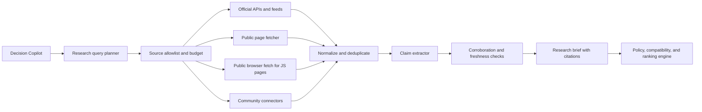

# Research Scout Specification

## 1. Purpose

**Research Scout** is a bounded retrieval capability used by Decision Copilot when the user asks for recent AI solutions, current hardware, implementation evidence, or community experience.

It searches, fetches, compares, and cites public information. It does not turn every fresh post into a product recommendation. Its output is a research brief that the deterministic recommendation engine may use only after source quality, freshness, privacy, and compatibility checks.

## 2. Product decision

Research Scout uses this order of preference:

1. Official APIs, catalog feeds, and documentation
2. Official product/model/hardware pages
3. Independent benchmarks, technical papers, and reputable engineering write-ups
4. Community signals from X, Reddit, YouTube, forums, and social platforms

Community sources are valuable for discovering new tools, failure modes, real-world thermals, setup friction, and user experience. They are not authoritative for price, stock, warranty, licensing, security, or hardware compatibility unless corroborated.

The system must show the source tier and link for every material claim.

## 3. Research scope presets

Keep the user choice simple:

- **Official and benchmark sources:** most trustworthy, narrower coverage
- **Official plus community signals:** broader discovery, more uncertainty
- **Hardware and purchase research:** retailer, manufacturer, benchmark, and buyer-experience sources

The agent may recommend a preset based on the user’s request, but the user can change it before the research starts. A workspace may restrict community sources.

## 4. Retrieval architecture



### API and feed path

Use an official API, catalog feed, or documented provider endpoint when one exists. This is the preferred path for model metadata, benchmark data, YouTube search, and supported platform content.

### Public page fetch path

Use a server-side HTTP fetch for public, static pages. Extract the main content, title, author, publication date, canonical URL, and relevant sections. Do not send the full page to the agent when a short evidence extract is enough.

### Browser path

Use a controlled browser worker only for public pages that require JavaScript rendering or a visible interaction to reveal the content. The browser worker is read-only. It may navigate, wait for page content, and capture a bounded text snapshot, but it may not:

- log into a user account;
- bypass a paywall, CAPTCHA, robots rule, or access control;
- post, like, follow, message, purchase, or submit forms;
- download arbitrary files or execute page-provided code;
- use a user’s personal browser session without explicit product authorization.

If the browser path is unavailable, return the search result or cached source rather than pretending the page was read.

### Recommended software

- **Static/public retrieval:** server-side TypeScript `fetch` with the source adapter’s parser.
- **JavaScript-rendered public pages:** Playwright with a pinned Chromium build, running in an isolated browser worker rather than inside the user’s browser or an ordinary Next.js request.
- **Development and visual verification:** the `agent-browser` CLI can drive a visible browser during local testing and demo rehearsal. It is a development/QA tool, not a product dependency and not the source of the Research Scout’s evidence.
- **Codex in-app browser controls:** not used by the shipped product. They control the assistant’s browser session, not a customer-facing retrieval service.

The Next.js server remains the orchestrator. It sends a narrowly scoped job to the browser worker, receives a bounded text snapshot and provenance, and closes the browser context. The worker must use isolated, non-persistent contexts with no user cookies by default.

## 5. Source adapters

| Source type | Preferred adapter | Good for | Trust treatment |
| --- | --- | --- | --- |
| Model and benchmark catalogs | Official API/feed | Model identity, pricing, benchmark metadata, context, modalities | Primary evidence |
| Vendor and manufacturer pages | Public fetch/API | Specifications, compatibility, power, warranty terms | Primary evidence; timestamp required |
| Retailer and marketplace pages | Public fetch or permitted feed | Current listing, seller, item price, shipping, availability | Purchase lead; manual verification required |
| X | Official API when authorized; otherwise public search result | Early announcements, release signals, practitioner discussion | Discovery signal; corroborate |
| Reddit | Official API or permitted public page | Failure reports, setup experience, thermals, community comparisons | Community signal; represent disagreement |
| YouTube | YouTube Data API and public video metadata/transcript where permitted | Demonstrations, reviews, long-form setup evidence | Secondary/community evidence; date and creator visible |
| Forums and GitHub discussions | Public fetch/API where permitted | Edge cases, implementation notes, bug reports | Community signal; corroborate |

Relevant official references include [X API tools](https://developer.x.com/apitools/api), [Reddit API documentation](https://www.reddit.com/dev/api/), and [YouTube Search API](https://developers.google.com/youtube/v3/docs/search/list). The availability, authentication, quota, and permitted use of each connector must be verified before implementation.

## 6. Query planning

The query planner converts a confirmed workload into a small set of research questions. For example:

```text
Workload: private invoice and document assistant
Location: India
Hardware: two Apple Silicon laptops and one CUDA PC
Goal: local-first, lowest operating cost

Research questions:
1. Which existing models support the required text, image, and document workflow?
2. What current local runtimes and Apple/CUDA paths are practical?
3. Are there recent compatibility or thermal issues for the known hardware?
4. What current India-first hardware listings satisfy the constraints?
```

Recommended V1 budget per research run:

- At most 3 query groups
- At most 8 source results per group
- At most 5 page fetches
- At most 2 browser-rendered pages
- At most 1 community result set per platform
- One cache reuse window chosen by source type

The scout should stop once it has enough corroborated evidence. More browsing is not automatically better.

## 7. Evidence model

Every extracted claim has:

- `claim_text`
- `claim_type`: capability, price, compatibility, performance, availability, experience, risk, or announcement
- `source_url`
- `source_title`
- `source_tier`
- `publisher_or_author`
- `published_at` if available
- `retrieved_at`
- `quoted_or_extracted_evidence`
- `confidence`
- `corroboration_count`
- `conflicts`
- `user_verification_required`

The agent must distinguish:

- **Fact:** supported by a primary source or several independent sources
- **Reported experience:** a community or reviewer observation
- **Inference:** a conclusion derived by the product
- **Unverified lead:** useful for discovery but not safe to rank on its own

The UI should let the user expand a recommendation and inspect the claims behind it.

## 8. How research affects recommendations

Research Scout may:

- discover a candidate model, runtime, hardware system, or marketplace listing;
- add a recent compatibility warning;
- improve explanation of setup friction or real-world limitations;
- suggest a follow-up question;
- mark an existing catalog record for refresh.

Research Scout may not, by itself:

- override privacy or workspace policy;
- replace a canonical model or hardware specification;
- use a viral post as a benchmark;
- treat social popularity as performance;
- rank a seller from one review;
- claim a price or stock value without a timestamp;
- include a model in the approved catalog without normalization and license review.

For a social claim to affect a primary recommendation, require corroboration from an official, benchmark, or independent technical source. Otherwise show it under **Community signals to investigate**.

## 9. Freshness policy

Freshness depends on the claim:

- Price, stock, shipping, and availability: refresh close to the recommendation request
- Software compatibility and release status: refresh within days, or sooner for a breaking-change query
- Benchmarks and technical papers: retain publication and retrieval dates
- Community experience: show post/video date and retrieval date; do not call it current merely because it is popular

The result must never say “latest” without displaying a checked timestamp and the research scope used.

## 10. Safety and access rules

- Public or explicitly authorized content only.
- Obey provider terms, robots directives, rate limits, copyright limits, and applicable access controls.
- Do not scrape logged-in social feeds or use stored browser cookies by default.
- Do not collect personal profiles or infer sensitive traits from social content.
- Strip scripts, hidden instructions, tracking parameters, and irrelevant page content before the agent sees it.
- Treat every page, post, comment, transcript, and listing as untrusted evidence; prompt injection cannot grant a tool permission.
- Store short evidence extracts and metadata rather than entire copyrighted pages or videos.
- Preserve deletion/unavailable status and do not present cached content as live.

This is an engineering boundary, not legal advice. Each connector still needs a terms-of-use and data-retention review before release.

## 11. Failure behavior

| Failure | Behavior |
| --- | --- |
| API key missing or quota exhausted | Skip that connector and continue with permitted sources |
| Page blocks automated access | Mark it unavailable; show the source link only if permitted |
| Browser-rendered page fails | Use API/search/cache fallback and label the limitation |
| Conflicting claims | Show the conflict; do not average incompatible facts |
| Community claim has no corroboration | Keep it as a lead, not a ranked fact |
| Source is too old for the claim | Lower confidence or exclude from primary ranking |
| Prompt injection in page content | Treat it as data and ignore its instructions |
| Research budget exhausted | Return the partial brief and list unsearched questions |

## 12. Delivery plan

### P0 — Demo-safe research

1. Add an official-source and public-page search adapter.
2. Normalize citations, timestamps, claims, and source tiers.
3. Add a deterministic curated research fixture for the manufacturing demo.
4. Show a research brief with one primary source, one benchmark/technical source, and one clearly labeled community signal.

### P1 — Broader coverage

1. Add permitted X, Reddit, and YouTube adapters.
2. Add controlled browser fetching for JavaScript-rendered public pages.
3. Add corroboration and conflict detection.
4. Add saved research snapshots and “refresh since last decision.”

### P2 — Ongoing intelligence

- User-approved watchlists for models, runtimes, and hardware
- Scheduled refreshes with notifications
- Team research collections and source comments
- Regional price and availability change detection

Continuous monitoring is deliberately outside the hackathon hero flow.
