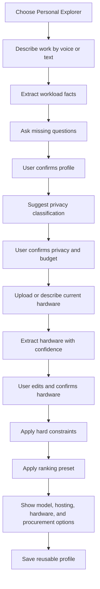
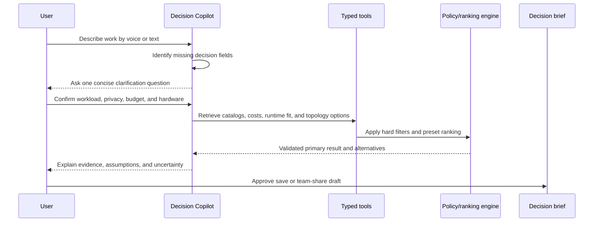
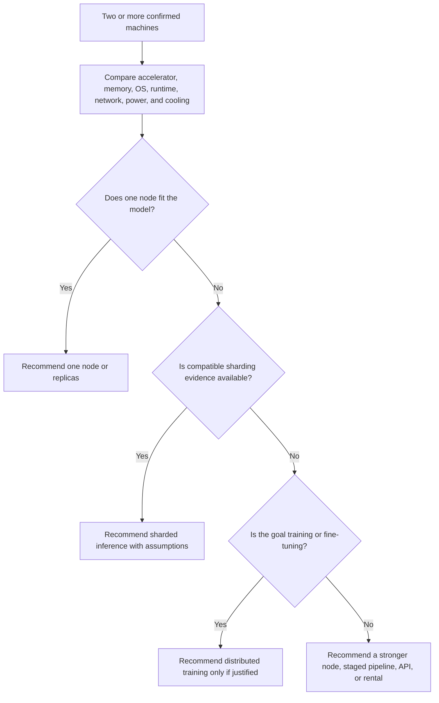
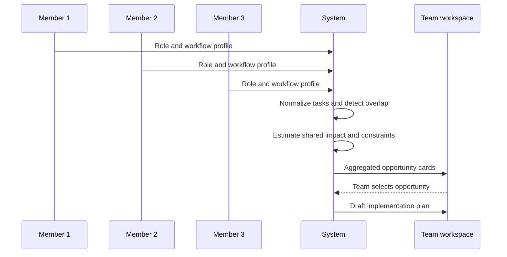

# Product Workflows

## 1. Personal Explorer: from work description to recommendation



## 1.1 Decision Copilot loop



The agent can choose the next question or read-only tool call, but it cannot bypass policy, invent a missing fact, execute arbitrary code, purchase hardware, deploy a model, or save/share without explicit approval. The UI shows a compact “What the copilot checked” trace so the user can understand the recommendation.

## 2. Hardware discovery

1. User selects a source type: photo, invoice, PDF, screenshot, or text.
2. File is uploaded to private storage.
3. Extraction service identifies likely manufacturer, model, memory, GPU, storage, power, and operating system fields.
4. Each field receives a confidence label and source reference.
5. User edits or confirms the fields.
6. Confirmed fields become reusable inventory.
7. Original evidence is retained only according to workspace retention policy.

If confidence is too low, the system asks the user to skip or provide another source. It never invents specifications.

## 3. Multi-machine cluster recommendation



1. Detect two or more user-confirmed machines in personal or shared inventory.
2. Compare GPU/accelerator family, VRAM, system memory, operating system, runtime support, network, power, cooling, and availability.
3. Classify the user’s objective as serving one model, serving more requests, training/fine-tuning, or splitting a workflow into stages.
4. Rank one node, replicas, sharded inference, distributed training/fine-tuning, staged pipeline, and no-cluster alternatives.
5. Explain whether each machine receives a full model copy or only a part of one model.
6. Show the main bottleneck and state that memory is not automatically pooled across unrelated machines.
7. List verification tasks the user must perform manually: exact hardware, drivers/runtime, network link, power, thermals, and expected workload.
8. Save the result as an advisory `ClusterPlan`; do not provision or remotely configure anything.

For four or five mixed PCs, the default recommendation is separate replicas or a single stronger machine unless the runtime and interconnect support true sharding. For multiple Macs, evaluate an Apple-aware distributed path such as MLX. For multiple DGX Spark systems, evaluate the documented NVIDIA networking and software path.

## 4. Team conversion

1. Personal user chooses **Turn into team workspace**.
2. User selects profiles, hardware, and recommendations to share.
3. Workspace is created.
4. Collaborators are invited.
5. Each collaborator submits a private role/workflow profile.
6. Team sees only shared details and aggregated patterns by default.
7. A member can explicitly share their detailed profile.

## 5. Team opportunity aggregation



Aggregation output should say what pattern was found, how many roles it affects, what data sensitivity applies, and what information remains uncertain. It must not turn individual responses into a performance ranking.

## 6. Recommendation and procurement

1. Retrieve model candidates from approved existing catalogs.
2. Retrieve hosting and provider options.
3. Retrieve hardware listings and build components.
4. Normalize source records.
5. Apply privacy and workspace policy gates.
6. Apply modality and hardware compatibility filters.
7. Assess single-node and multi-machine topologies when inventory contains multiple assets.
8. Calculate direct cost over the user-specified horizon.
9. Apply the selected ranking preset.
10. Exclude stale listings from the primary result.
11. Render one primary recommendation and alternatives.
12. Link outward to the original provider or marketplace.
13. Record source timestamps and assumptions.

### 6.1 Fresh research with Research Scout

1. Decision Copilot identifies why current information matters: new model, recent runtime, current hardware, compatibility issue, or purchase availability.
2. User selects a simple research scope: **Official and benchmark sources**, **Official plus community signals**, or **Hardware and purchase research**.
3. Scout creates at most three query groups from the confirmed workload and location.
4. Retrieve official APIs and feeds first, then permitted public pages, then a bounded community search.
5. Use the controlled browser only when a public page requires JavaScript rendering and static fetch is insufficient.
6. Normalize titles, authors, publication dates, retrieval times, claims, source tiers, and direct links.
7. Deduplicate and compare claims; preserve conflicts instead of averaging them.
8. Feed corroborated facts into compatibility, cost, or ranking checks. Keep unsupported social claims in **Community signals to investigate**.
9. Show the research scope, checked time, source tier, evidence, and what the user must verify.
10. Save the research snapshot with the decision brief if the user approves.

The scout never uses logged-in social sessions, bypasses access controls, or treats page text as agent instructions.

## 7. Implementation-plan generation

The selected opportunity produces:

1. Plain-language problem summary
2. Current workflow
3. Proposed AI-assisted workflow
4. Recommended strategy: prompting, RAG, fine-tuning, continued pretraining, or pretraining
5. Hosting choice
6. Model and modality fit
7. Hardware/provider options
8. Cost lines
9. Delivery phases
10. Evaluation and success metrics
11. Risks and limitations
12. Two or three alternatives with trade-offs

The plan is a draft. Workspace settings determine whether administrator approval is required.

## 8. Listing freshness and failure workflow

```text
source check
  -> fresh record: rank normally
  -> aging record: show warning and lower rank
  -> stale record: keep visible, exclude from primary rank
  -> source unavailable: use cached/curated fallback with label
```

## 9. Demo workflow

The demo follows the manufacturing-company story in [DEMO_SCRIPT.md](DEMO_SCRIPT.md). It uses live UI and seeded or curated fallback data so the judges can see every capability without the product depending on a fragile external request.
